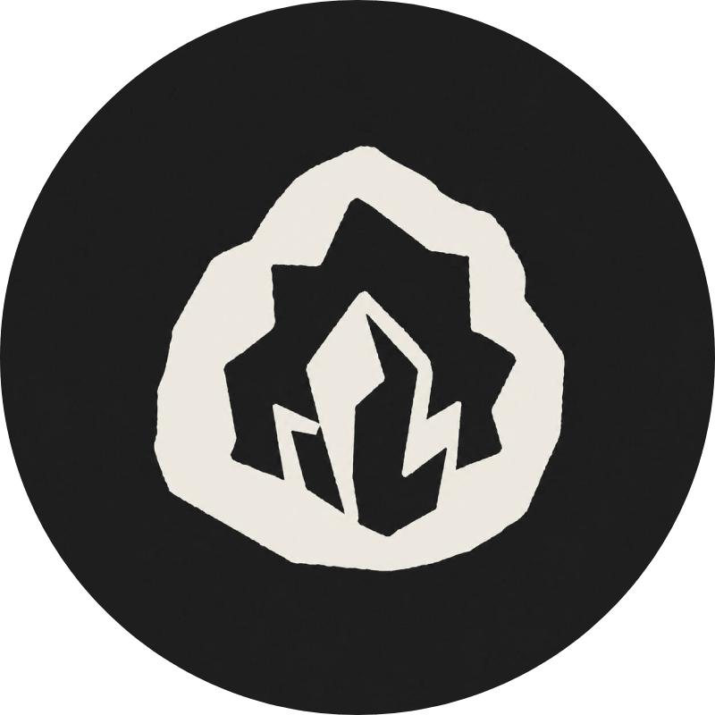

  

# Geode

**[Obsidian](https://obsidian.md) plugin** for remote sync, MCP, and an API for your vault.

## Why

**Geode** syncs your vault across your devices through storage you own, encrypted before anything
leaves your hands. Your agents read/write to the same vault via MCP or an API, laptop asleep or not.
Your notes, your storage, your keys. Built for agents.

## Security

Every change is scanned by CodeQL, dependencies are audited in CI and kept current by Dependabot,
all workflow actions are pinned by hash, and the OpenSSF Scorecard runs weekly; the badge at the top
of the README is the latest score. Think you've found a vulnerability? See
[SECURITY.md](./SECURITY.md).

## License

Geode is available under the [Elastic License 2.0](./LICENSE); free to use, modify, and self-host.
The one thing you can't do is offer Geode itself to others as a hosted or managed service.
